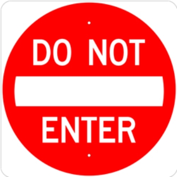

# Traffic Rules and Regulations in USA

1. In USA steering wheels are situated on left side of the car.

2. Always drive on right side of the road.

3. Pedestrain should cross the road only at zebra crossing.

4. Every vechile should maintain a speed of 15 m/h.

5. Vehicles should not pass other vehicles where there is no passing zone

6. Yellow lines separate traffic moving in opposing directions.

## Road signs
<<<<<<< HEAD
<<<<<<< HEAD
=======

1.Stop sign: You must wait until crossing vehicles and pedestrains have cleared.
>>>>>>> 25e9e857e5b4b610d4da9231e07ddbb68e9c2d99
=======

1. Stop sign: You must wait until crossing vehicles and pedestrains have cleared.

2. Do not enter sign: When you see this sign at road openings do not enter this road.
>>>>>>> 1b55f074e3ac23f7a229fcd483e519e4f78681ef
