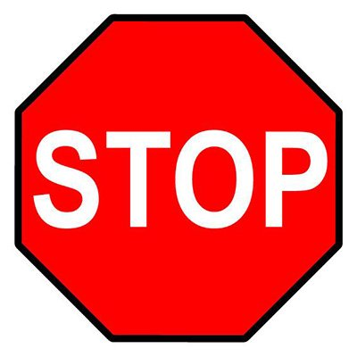

# Traffic Rules and Regulations in USA

1. In USA steering wheels are situated on left side of the car.

2. Always drive on right side of the road.

3. Pedestrain should cross the road only at zebra crossing.

4. Every vechile should maintain a speed of 15 m/h.

5. Vehicles should not pass other vehicles where there is no passing zone

6. Yellow lines separate traffic moving in opposing directions.

## Road signs

1. Stop sign: You must wait until crossing vehicles and pedestrains have cleared.

2. Do not enter sign: When you see this sign at road openings do not enter this road.

3.School Crossing: Slow down and watch for children to cross the road

## Signal lights

- Red signal
Traffic control signals are devices placed along, beside, or above a roadway to guide, warn, and regulate the flow of traffic, which includes motor vehicles, motorcycles, bicycles, pedestrians, and other road users.

- Red light
RED—A red signal light means STOP.
A right turn can be made against a red light ONLY after you stop and yield to pedestrians and vehicles in your path. DO NOT turn if there is a sign posted for NO TURN ON RED.

- YELLOW—A yellow signal light warns you that the red signal is about to appear. When you see the yellow light, you should stop, if you can do so safely. If you can't stop, look out for vehicles that may enter the intersection when the light changes.

- GREEN ARROW—A green arrow means GO, but first you must yield to any vehicle, bicycle, or pedestrian still in the intersection. The green arrow pointing right or left allows you to make a protected turn; oncoming vehicles, bicycles, and pedestrians are stopped by a red light as long as the green arrow is lit. 

## REFERENCES

- https://driving-tests.org/beginner-drivers/rules-of-the-road/

- https://driversed.com/driving-information/signs-signals-and-markings/traffic-signals.aspx
